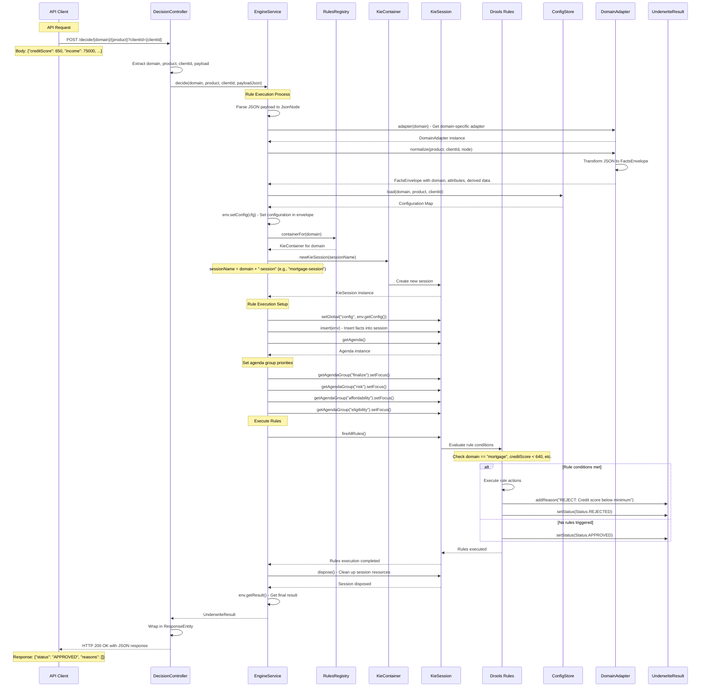

# Underwriter Rules Engine - Sequence Diagrams

## 1. Application Startup & Rules Onboarding Flow

## 2. Request/Response Flow for Rule Execution

## 3. Rules Development & Deployment Flow

## 4. Error Handling & Fallback Flow

## 5. Rule Update & Hot Reload Flow

## Key Benefits of This Architecture

1. **Scalability**: New domains can be added without modifying existing code
2. **Reliability**: Fallback mechanisms ensure application always works
3. **Flexibility**: Support for both dynamic and embedded rule loading
4. **Maintainability**: Clear separation between rule logic and application logic
5. **Hot Reloading**: Rules can be updated without application restarts (with KieScanner)
6. **Domain Isolation**: Each domain's rules are independent and can be versioned separately
