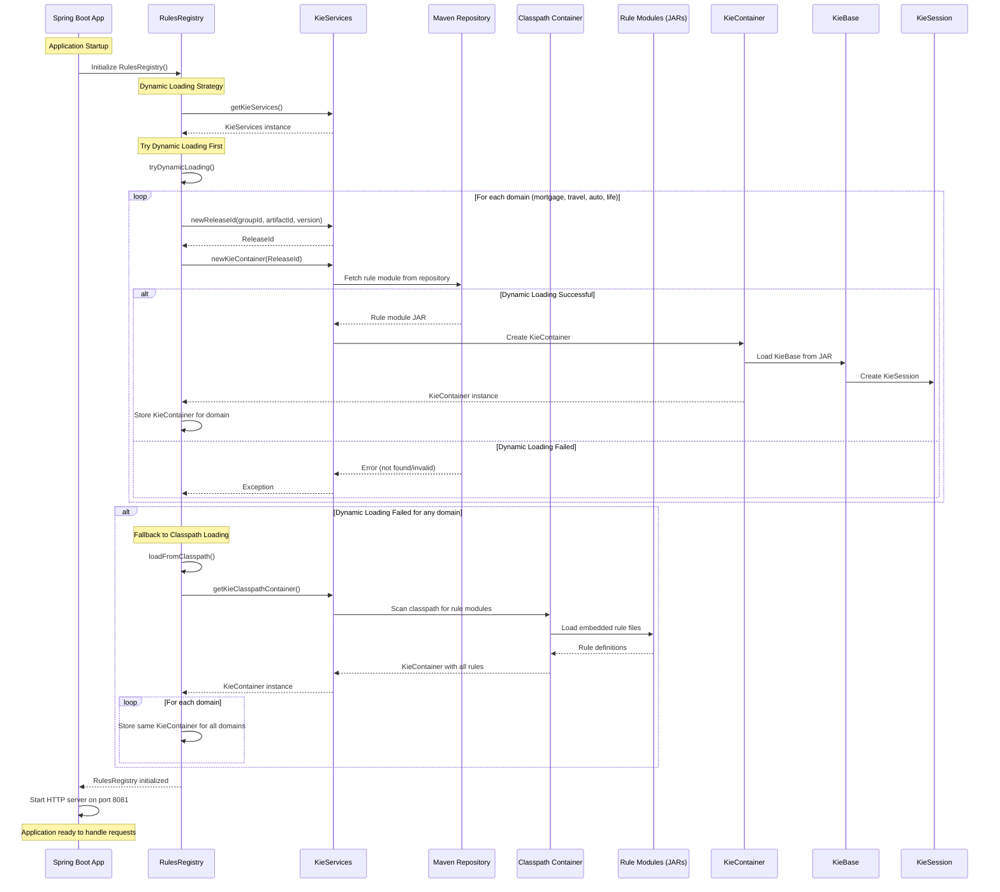

# Application Startup & Rules Onboarding Flow

This sequence diagram illustrates the application startup process, specifically focusing on how rule modules are loaded and initialized within a Spring Boot application.

## Key Components

**Participants:**
- **Spring Boot App:** The main application initiating the process
- **RulesRegistry:** Manages and registers rules
- **KieServices:** Service for managing Kie (Knowledge Is Everything) framework
- **Maven Repository:** External repository for fetching rule modules (JARs)
- **Classpath Container:** Scans application's classpath for rule modules
- **Rule Modules (JARs):** Actual rule definitions packaged as JAR files
- **KieContainer:** Container for KieBases and KieSessions
- **KieBase:** Repository of all knowledge definitions
- **KieSession:** Active session where rules are executed

## Flow Overview

The diagram shows two main strategies for loading rules:
1. **Dynamic Loading Strategy (Preferred):** Attempts to fetch rule modules from a Maven Repository
2. **Fallback to Classpath Loading:** If dynamic loading fails, loads rules from the application's classpath

This architecture ensures the application can start successfully even if external repositories are unavailable, providing both flexibility and reliability.
