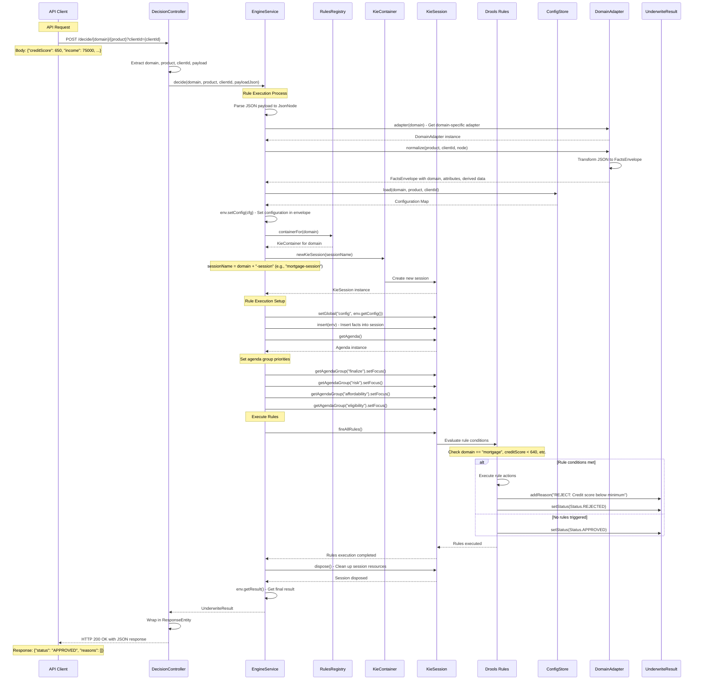

# Request/Response Flow for Rule Execution

This sequence diagram illustrates a rule execution process within a decision-making system, showing the interactions between various components from an initial API request to the final decision and response.

## Key Components

**Participants:**
- **API Client:** Initiates the request
- **DecisionController:** Receives the API request and orchestrates the decision process
- **EngineService:** Manages the rule execution, interacting with various rule engine components
- **RulesRegistry:** Provides access to KieContainers for specific domains
- **KieContainer:** A container for Drools knowledge bases
- **KieSession:** A runtime session for executing rules
- **Drools Rules:** The actual business rules being evaluated
- **ConfigStore:** Stores configuration data
- **DomainAdapter:** Transforms and normalizes data specific to a domain
- **UnderwriteResult:** Represents the outcome of the underwriting process

## Flow Overview

The process follows these main phases:

1. **API Request Processing:** Client sends request with domain, product, clientId, and payload
2. **Data Preparation:** Parse JSON, get domain adapter, normalize data, load configuration
3. **Session Setup:** Create KieSession, set global variables, insert facts, configure agenda groups
4. **Rule Execution:** Fire all rules with prioritized agenda groups (finalize → risk → affordability → eligibility)
5. **Result Processing:** Get final result, clean up session, return response

## Agenda Group Priority

The system uses prioritized agenda groups to ensure rules are executed in the correct order:
1. **finalize** - Final decision processing
2. **risk** - Risk assessment rules
3. **affordability** - Affordability calculation rules
4. **eligibility** - Basic eligibility rules

This ensures that more specific rules (like finalization) take precedence over general rules (like eligibility).
